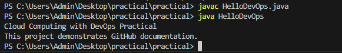

# Cloud Computing with DevOps Practical

## Students Information

| Name | Enrollment Number | Practical Set |
|------|------------------|---------------|
| Bhumi Kurmi | 202504104610055 | Set B |
| Vinit Bawjee |202504104610014  | Set A |

---

## Logos

### University: UTU

### Department: SRIMCA

---

## Subject
Cloud Computing with DevOps

---

## Practical Overview
This repository contains practical exercises related to Cloud Computing with DevOps.  
It includes Java programs, GitHub operations, and documentation.

---

## Program Output

---

## Notes

- Each practical task is organized in separate files.
- requirements.txt contains dependencies.
- Images and screenshots are included for demonstration.